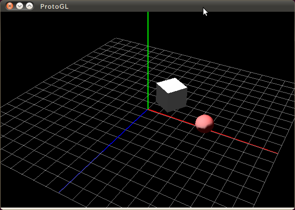

ProtoGL
=======

### What is ProtoGL? ###

This is a simple 3D framework based on OpenGL.

### Target users for ProtoGL ###

The target user for ProtoGL is the people who think:
- native OpenGL APIs are too low level
- full-scale 3D frameworks are too rich for simple prototyping

### Install ###

1. Install freeglut and opengl
    $ sudo apt-get install freeglut3 freegult3-dev

2. Locate ProtoGL directory to somewhere you like.
   (ProtoGL only consists of header files)

### Sample code ###

    #include "ProtoGL.hpp"

    static const double WINDOW_W = 600;
    static const double WINDOW_H = 400;

    class SampleView : public pgl::View {
        protected:
        virtual bool onCreate(void) {
            /*
             * setup camera
             */
            _camera.SetupPerspectiveCamera(30.0, WINDOW_W / WINDOW_H, 0.1, 100);
            _camera.SetPosition(6.0, 8.0, 10.0);

            /*
             * add objects & light
             */
            pgl::Object3D *grid, *axis, *cube, *sphere;
            pgl::Light *light;
            pgl::Material *material;
        
            grid = new pgl::GridObject(10, 10, 20, 20);
            _scene.AddObject(grid);
        
            axis = new pgl::AxisObject(5);
            _scene.AddObject(axis);

            material = new pgl::Material();
            cube = new pgl::CubeObject(0.8, material);
            _scene.AddObject(cube);

            material = pgl::Material::Create(pgl::Material::RUBY);
            sphere = new pgl::SphereObject(0.3, material);
            cube->Add(sphere);

            light = new pgl::Light();
            light->SetPosition(0, 10, 0, 1);
            _scene.AddLight(light);
        
            /*
             * set pose
             */
            cube->Translate(1, 1, 0);
            sphere->Translate(2, 0, 0);
            cube->RotateY(-30);
        
            return true;
        }
    };

    int
    main(int argc, char *argv[])
    {
        SampleView view;
        pgl::Application::Start(argc, argv, &view, WINDOW_W, WINDOW_H);
    
        return 0;
    }

### Screen shot ###

### Change log ###

